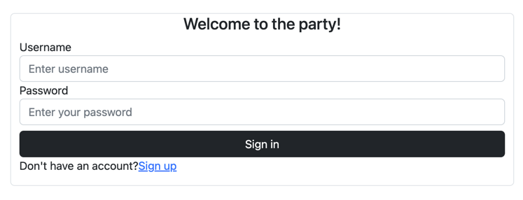
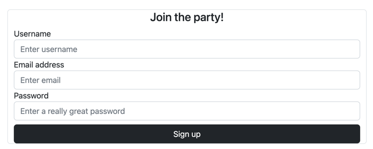
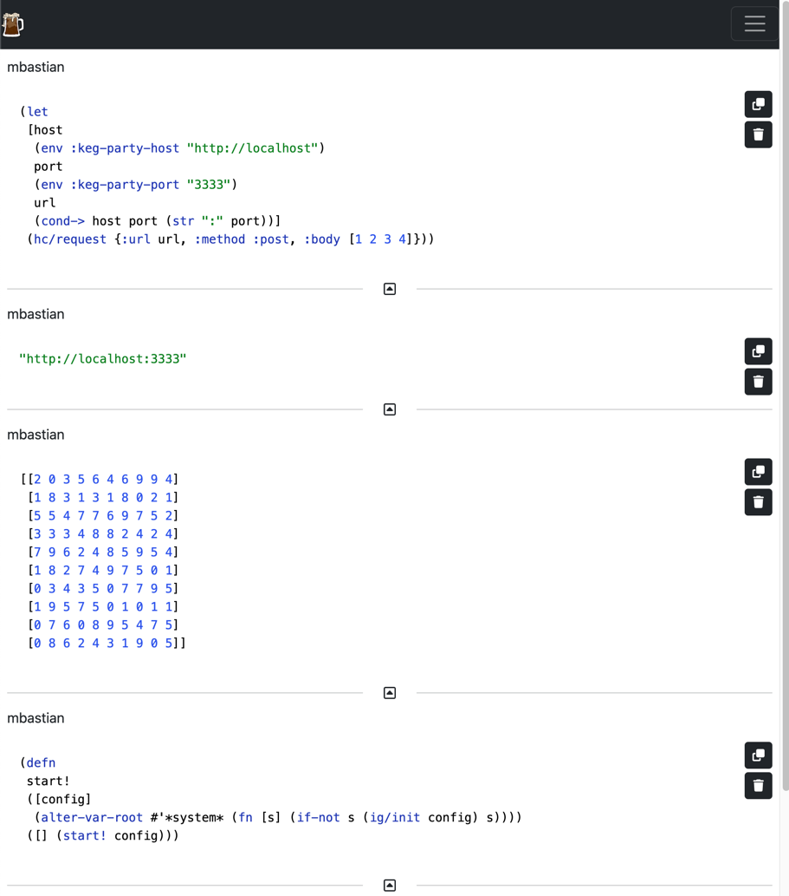

# keg-party

`tap>`, party style!

## Usage

### Launch the server

Start your party by launching a server with one of the following options:

#### The super easy way
```shell
clojure -Sdeps '{:deps {com.github.markbastian/keg-party
                  {:git/url "https://github.com/markbastian/keg-party"
                  :sha     "984d8db1d0f0f3e80154dd6775ccfd0a6b740229"}}}' \
                   -X:server keg-party.main/run
```

#### Other ways

- `clj -X:server keg-party.main/run` from the cloned project
- Uberjar:
  - Build with `clj -T:build uber`
  - Run with `java -jar target/keg-party-${LATEST_VERSION}-standalone.jar`

By default, the server will run at `http://localhost:3333`. You can change these defaults as described in the
configuration section below.

### The initial experience

When you connect to the server, you'll be directed to a login page:



If you haven't created an account, follow the "Sign up" link to do so:



Whether you are logging in to an existing account or creating a new one, you'll be immediately directed to the tap feed once you are signed in:



Start playing around and have some fun!

### Connect your client

Invite all your friends to the party by adding `keg-party-client.jar` as a dependency to your project.

[](https://clojars.org/com.github.markbastian/keg-party-client)

Configure your environment with the following environment variables:
- `KEG_PARTY_HOST`, defaults to http://localhost
- `KEG_PARTY_PORT`, defaults to 3333
- `KEG_PARTY_USERNAME`, defaults to `(or (env :keg-party-username) (env :user))`
- `KEG_PARTY_PASSWORD`, no default. This is your password from the setup page.
  - This is the only env var that you _must_ set if you aren't using the defaults.

Once you've added the client jar and configured the environment, connect the tap target by invoking:

```clojure
(do
  (require '[keg-party.clients.rest-client :as kprc])
  (kprc/tap-in!))
```

For an automated experience, do the following:
- Create a local dev or user profile if you don't already have one
  - (e.g. add `:dev {:extra-paths ["dev"]}` to your `~/.clojure/deps.edn` `:aliases`)
- In that profile's extra paths, add a ns that looks something like this:

```clojure
(ns user
  (:require [keg-party.clients.rest-client :as kprc]))

(println "KEG PARTY TAPPING IN")
(kprc/tap-in!)
```

If you already have such a namespace, just add the above to it.

Ensure that this profile is active when you launch your REPL. When you do so, this code will be run and you are good to go.

Test your config you by doing something like this:

```clojure
(tap> {:best-drink-ever     :diet-dew
       :the-next-best-thing :diet-dr-pepper})
```

Head on over to your party server and see the data!

## Misc

Run the project's tests (they'll fail until you edit them):

    $ clojure -X:test:runner

Build a deployable jar of this library (Still needs work):

    $ clojure -X:jar

## TODOs

Features:
- [X] Persistence
- [ ] Add admin profile concept so that only admins can see client tabs, for example
- [X] Expose favorites
  - [ ] Create favorites view (or do something else with it)
  - [X] Add "nuke all non favorites" option
- [ ] User spaces/channels
- [ ] Collaborative tap comments
- [ ] Drill-down/explore individual tap data
- [ ] When you sign up, show a page with a hint (copyable code?) for how to setup your tap target
- [ ] Push client code to clojars
  - Maybe make a separate repo
- [ ] Can I inject the client via a [java agent](https://dgopstein.github.io/articles/clojure-javaagent/)?

Architecture & Tech debt:
- [X] Create protocols for db ops to hide implementation (e.g. users and taps)
- [ ] Make events multimethods as in `dispatch-command`
  - `generate-event` or `process-event`
  - Consider - do we combine `htmx-notifications` into `events`?
    - Will there be other notification types?
    - Do we care at this point?
- [ ] Tests
- [ ] Rename `generic` to something like `ezcmd` or something
- [ ] Make command-event bridge async
  - Queue interface
    - Use core.async for now
    - Sets it up for something like SQS in the future
- [ ] Tied to the above, do some sort of event log maybe
- [ ] With an event log we could batch notifications so we don't hammer the UI with too many taps at once
- [X] Refactor `migrations` into something that isn't a terrible name
- [X] BUG - When you go to http://localhost:3333/ in a new incognito window you get
  - `HTTP ERROR 500 Cannot invoke "java.lang.CharSequence.length()" because "this.text" is null`
  - Why?
  - If you go to `/login` it gets fine. It should redirect and, in fact, does later on.
- [ ] Refactor repository signatures to always take a partial object map of tap, user, etc.
- [X] Put pages into a package with one page per actual page
- [ ] Clean up inline js fragments and maybe put them in an actual js file.

Bugs:
- [X] 3 starred taps, then add like 20 unstarred taps. Delete the unstarred taps.
  - The starred don't jump to the top, you have to refresh
  - How do I fix this?
  - Probably just a full swap since this is so destructive (Yep)
    - Instead of nuking the unstarred on the FE just reload with 10 starred
- [ ] Drilling down to non-parseable entities blows up
- [X] Figure out how to serve resources with clj -X execution

Client QoL:
- [ ] Add args for deps so we can easily launch with -X args
- [ ] Add client profile so you can just add the profile and connect the tap at launch

Docs:
- [ ] Documentation with screenshots
- [ ] Tutorials

Questions:
- In SQLite can I delete an entry with a FK pointing to it?
  - It's a stupid pragma thing in SQLite

## License

Copyright © 2023 Mark Bastian

Distributed under the Eclipse Public License version 1.0.
